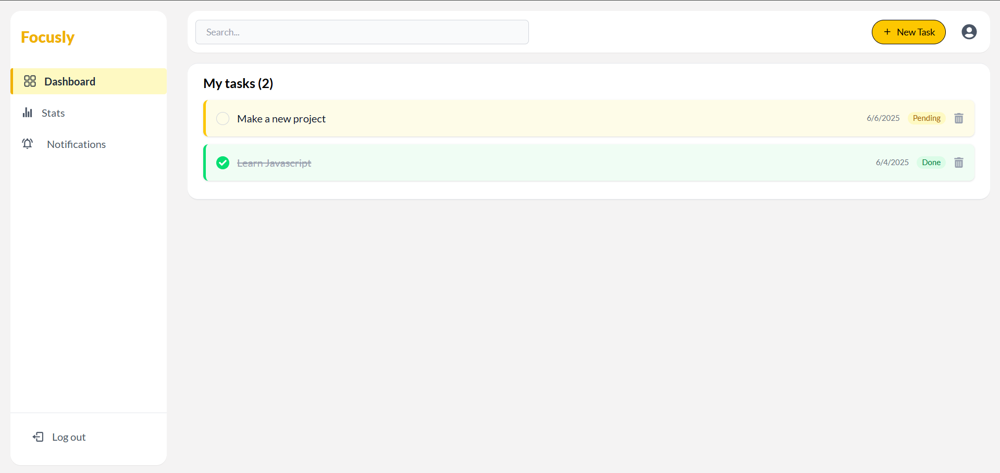
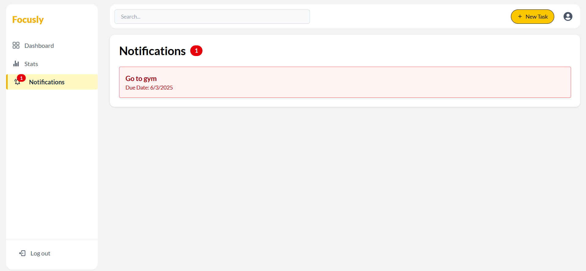
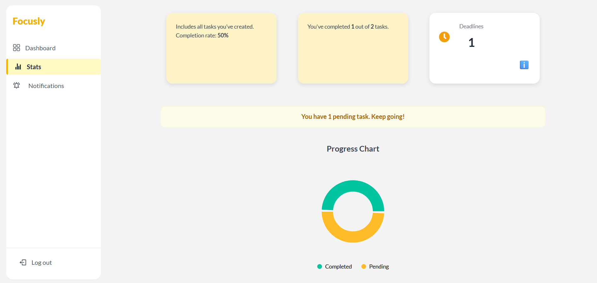

# 🚀 Focusly – Productivity Dashboard

A modern, responsive productivity app built with React, Firebase, and Zustand. Focusly helps users manage tasks, track progress, and stay organized with a clean and engaging interface.

🔗 **Live Demo:** [https://focusly-prod.netlify.app](https://focusly-prod.netlify.app)

---

## 📸 Preview

![App Screenshot]




---

## 🧰 Tech Stack

- **Frontend:** React, Vite, Tailwind CSS, React Router DOM, Zustand, Framer Motion
- **Backend / Database:** Firebase Auth & Firestore
- **Other Libraries:** React Icons, React Hot Toast, Recharts
- **Dev Tools:** ESLint, Git, GitHub

---

## ✨ Features

- 🔐 Firebase Authentication with protected routes
- ✅ Task creation, deletion, and management
- 📊 Productivity stats with interactive charts (Recharts)
- 🔔 Real-time notifications for due/overdue tasks
- 🧭 Sidebar with live badge updates
- ☁️ Firestore integration with secure access rules
- 🎨 Smooth animations using Framer Motion, Darkmode

---

## 🏗️ Folder Structure

```
src/
├── components/       # Reusable UI components
├── pages/            # App pages (Dashboard, Stats, Notifications, etc.)
├── store/            # Global state (Zustand)
├── firebase/         # Firebase config and setup
├── layouts/          # App layout components
└── App.jsx           # Main application logic and routing
```

---

## ⚙️ Getting Started

### ✅ Prerequisites

- Node.js v14+
- npm v6+
- Firebase project with Firestore and Authentication enabled

### 🛠 Installation

```bash
# Clone the repo
git clone https://github.com/IulianFrunza98/productivity-react-app
cd productivity-react-app

# Install dependencies
npm install
```

### 🔐 Firebase Configuration

Create a `.env` file in the root folder and add your Firebase credentials:

```env
VITE_FIREBASE_API_KEY=your_api_key
VITE_FIREBASE_AUTH_DOMAIN=your_auth_domain
VITE_FIREBASE_PROJECT_ID=your_project_id
VITE_FIREBASE_STORAGE_BUCKET=your_storage_bucket
VITE_FIREBASE_MESSAGING_SENDER_ID=your_sender_id
VITE_FIREBASE_APP_ID=your_app_id
```

### 🚀 Run the App

```bash
npm run dev
```

App will be running at: [http://localhost:5173](http://localhost:5173)

---

## 🧪 Build for Production

```bash
npm run build
```

---

## 🔐 Security

- Environment variables are managed via `.env` (excluded from repo)
- Firebase rules restrict access to authenticated users
- Routes are protected and redirect unauthorized users

---

## 🤝 Contributing

Feel free to fork the repository and submit a pull request. Feedback and improvements are welcome!

---

## 👤 Author

**Iulian Frunză**  
Front-End Developer

- GitHub: (https://github.com/IulianFrunza98)
- Linkedin: (https://www.linkedin.com/in/iulian-costel-frunza-4736a8330/)
- Email: (fiulian87@yahoo.com)

---

## 📄 License

Licensed under the [MIT License](LICENSE).
